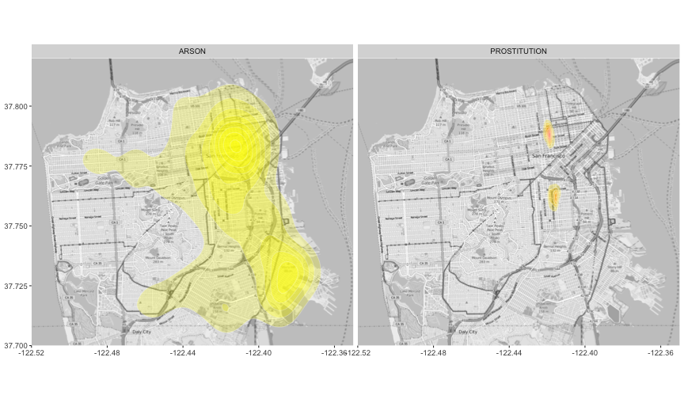

## Mapping Crime in San Francisco

### - The SF Crime App displays a map of San Francisco with a crime heat map overalyed.

### - The App gives the user a view of the most common locations for each category of crime in San Francisco.

### - After choosing a category, the app generates a map of the location of each type of crime.

---

## Compare geographical distribution between sixteen crime categories

- Arson  
- Assault 
- Bribery 
- Burglary  
- Driving Under the Influence 
- Drug/Narcotic 
- Embezzlement 
- Extortion

    

- Fraud 
- Gambling 
- Larceny/Theft 
- Prostitution 
- Robbery 
- Sex Offenses 
- Suicide 
- Vehicle Theft

---

## Example of how crime locations differs by category

Here are the maps for where Arson and Prostituion arrests occur most often.

---

## The San Francisco Crime App can help to keep us safe

### - Being aware of the most common locations for crimes to occur can allow a visitor to San Francisco to safely enjoy the city to the fullest.

### - The SF Crime App allows users to look for the crime hot spots in the city.

### - Examining the crime heat maps can also show trends in the different types of crimes occuring around the city.
